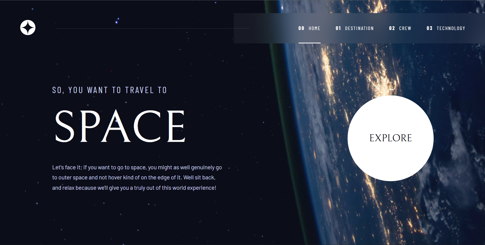

# Space Tourism Website

A responsive, multi-page space tourism website built with HTML, SCSS, and JavaScript, based on the [Frontend Mentor Space Tourism challenge](https://www.frontendmentor.io/challenges/space-tourism-multipage-website-gRWj1URZ3).



## Links

- Live site: [safeya-yasien.github.io/space-tourism-website-main](https://safeya-yasien.github.io/space-tourism-website-main/)
- Repository: [github.com/Safeya-Yasien/space-tourism-website-main](https://github.com/Safeya-Yasien/space-tourism-website-main)

## Features

Users can:

- View an optimized layout for every page on mobile, tablet, and desktop
- See hover states on all interactive elements
- Navigate between the Home, Destination, Crew, and Technology pages
- Switch between tabs on each page (destinations, crew members, technologies) to see new content

## Built with

- Semantic HTML5
- CSS
- Vanilla JavaScript
- CSS Flexbox and Grid
- Mobile-first responsive design
- `data.json` for page content

## Project structure

```
├── assets/        images and icons
├── css/
├── js/            scripts
├── data.json      destination, crew, and technology data
├── index.html
├── destination*.html
├── crew*.html
└── technology*.html
```

## What I learned

## Continued development

Ideas you might want to explore next, for example:

- Add page transitions and keyboard navigation for the tabs
- Improve accessibility (ARIA roles for tabs, focus states)
- Rebuild it with React as part of my MERN stack learning

## Author

- Portfolio: [safeya-yasien.vercel.app](https://safeya-yasien.vercel.app)
- GitHub: [@Safeya-Yasien](https://github.com/Safeya-Yasien)
- LinkedIn: [Safeya Yasien](https://www.linkedin.com/in/safeya-yasien/)

## Acknowledgments

Design and challenge by [Frontend Mentor](https://www.frontendmentor.io), in collaboration with Scrimba and Kevin Powell.
